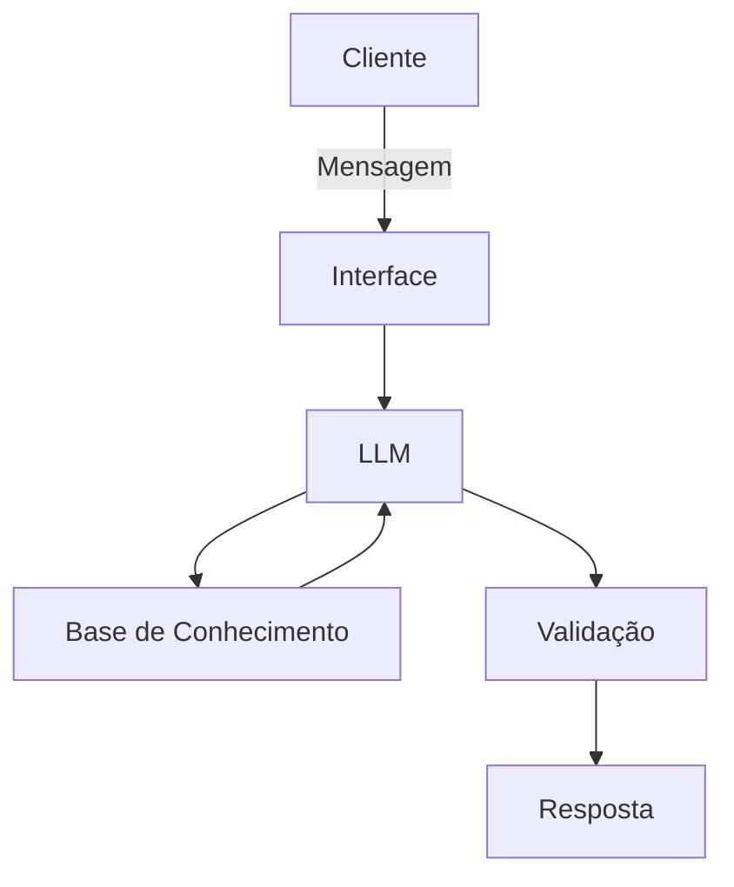

# Documentação do Agente

## Caso de Uso

### Problema
A alta volatilidade e o fluxo ininterrupto de dados (24/7) no mercado de criptoativos tornam humanamente impossível monitorar todas as oportunidades e riscos em tempo real, levando a decisões baseadas em FOMO (medo de ficar de fora) ou falta de análise técnica/fundamentalista.

### Solução
O agente utiliza a janela de contexto expandida e as capacidades de raciocínio do Gemini para sintetizar dados de múltiplas fontes (on-chain, redes sociais e exchanges). Ele atua proativamente enviando alertas de anomalias de preço, resumindo notícias críticas e executando análises de sentimento instantâneas para dar suporte à decisão do usuário.

### Público-Alvo
Investidores de criptoativos (varejo e intermediários), traders que buscam automação de análise e entusiastas de DeFi que precisam de monitoramento de portfólio.
---

## Persona e Tom de Voz

### Nome do Agente
GeminiCrypto

### Personalidade
Analítico, vigilante e consultivo. O agente se comporta como um analista sênior que prioriza dados sobre especulações, mantendo uma postura neutra mesmo em momentos de euforia ou pânico do mercado.

### Tom de Comunicação
Técnico-acessível. Utiliza terminologia do mercado (HODL, Gas Fee, Bullish/Bearish) de forma natural, mas explica conceitos complexos quando necessário.

### Exemplos de Linguagem
Saudação: "Relatório de mercado pronto. O BTC apresenta estabilidade, mas detectei movimentação atípica em altcoins de IA. Por onde começamos?"
Confirmação: "Análise técnica processada. Vou cruzar esses indicadores com o volume das últimas 4 horas para você."
Erro/Limitação: "Meus dados de rede para este token específico estão desatualizados no momento. Recomendo verificar o explorador de blocos diretamente enquanto sincronizo."

---

## Arquitetura

### Diagrama

### Componentes

| Componente | Descrição |
|------------|-----------|
| Interface | [Streamlit] |
| LLM | [Gemini 1.5 Flash (pela baixa latência e alta janela de contexto) via API.] |
| Base de Conhecimento | [Integração via Function Calling com APIs de preços (CoinGecko/CoinMarketCap) e feeds RSS.] |
| Validação | [Camada de filtragem que compara o output do LLM com dados numéricos brutos da API.s] |

---

## Segurança e Anti-Alucinação

### Estratégias Adotadas

Grounding: O agente é instruído a priorizar dados retornados pelas funções da API sobre o conhecimento interno do modelo.
Citação de Fontes: Toda análise de sentimento deve indicar de quais redes ou portais a informação foi extraída.
Reconhecimento de Ignorância: Configuração de System Instructions para responder "Dados insuficientes" caso a confiança na análise técnica seja baixa.
Filtro de Recomendação: O agente inclui um disclaimer automático de que suas análises não constituem aconselhamento financeiro direto.

### Limitações Declaradas
O agente não possui custódia de chaves privadas nem realiza transações financeiras diretamente.
Não prevê o futuro (previsões de preço são baseadas em probabilidades estatísticas e histórico).
Dependência da latência de APIs externas de terceiros para dados em tempo real.
